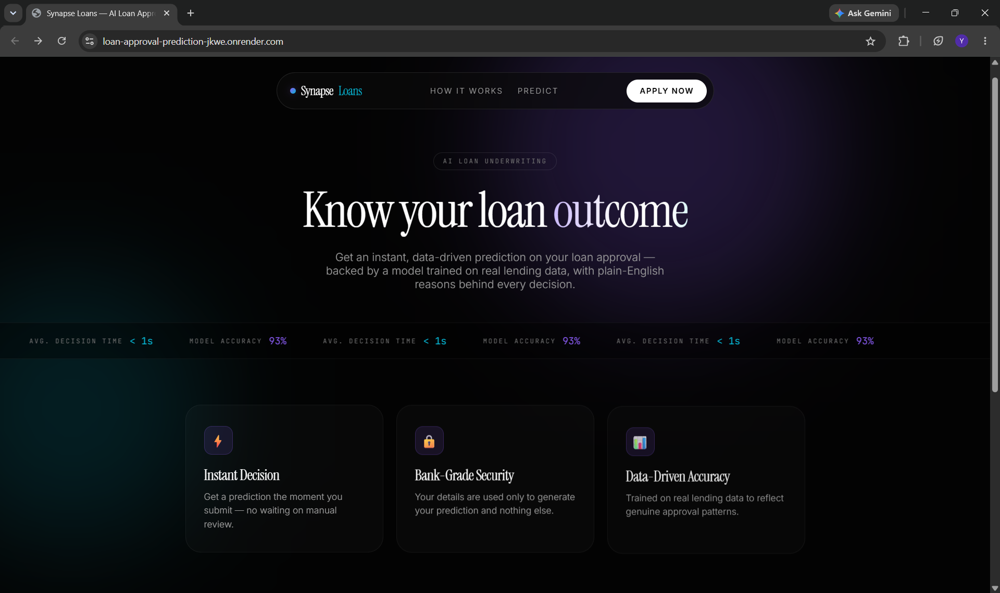
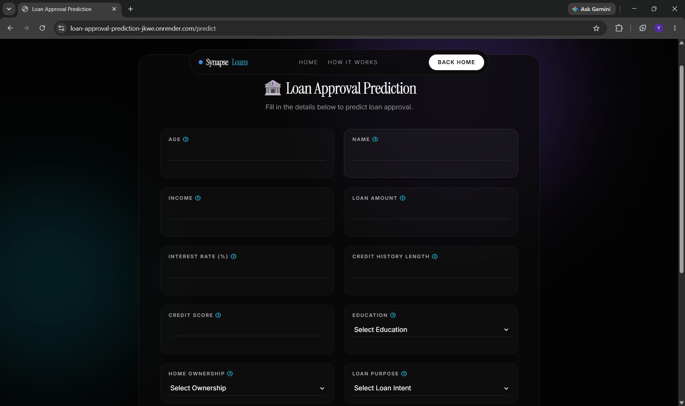
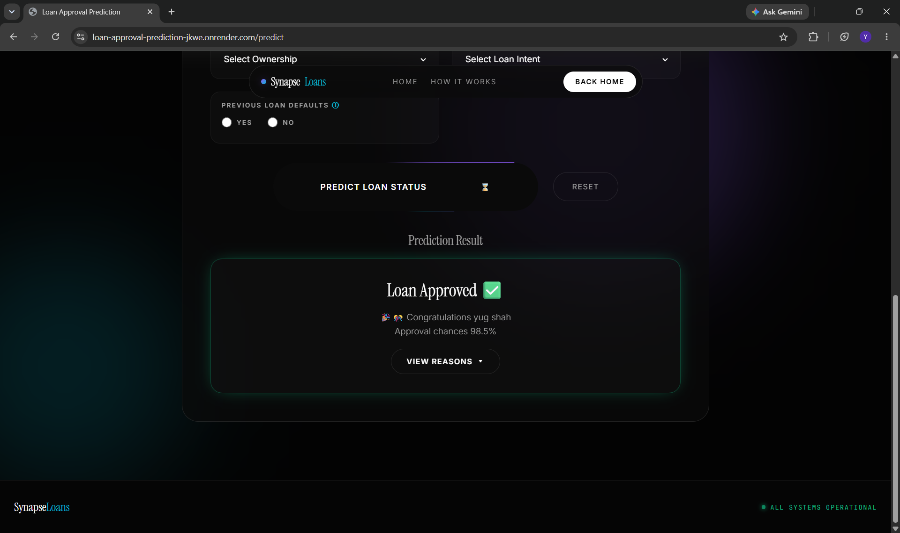
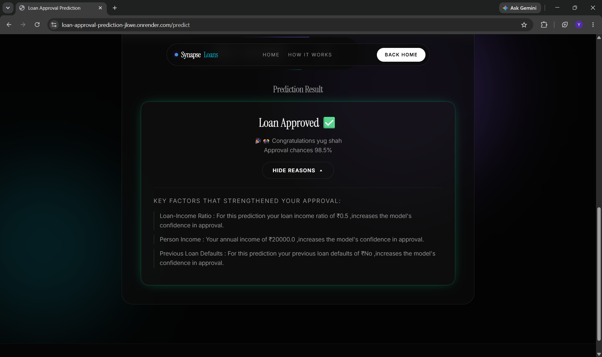
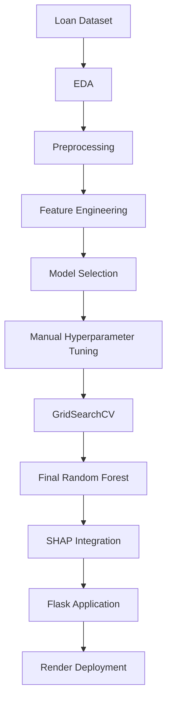

# 🏦 Loan Approval Prediction using Machine Learning


An end-to-end Machine Learning project that predicts loan approval outcomes based on applicant and loan-related information. The project demonstrates a complete ML workflow, from exploratory data analysis and data preprocessing to feature engineering, model selection, hyperparameter tuning, explainability using SHAP, and deployment with Flask.

## 🚀 Live Demo

🌐 **Live Application:** <https://loan-approval-prediction-jkwe.onrender.com/>

> **Note:** This application is hosted on Render's free tier. The first request after inactivity may take approximately **1–2 minutes** while the server wakes up. Subsequent requests are much faster.

## ⭐ Key Features

- End-to-end Machine Learning pipeline
- Comprehensive Exploratory Data Analysis (EDA)
- Feature Engineering and Data Preprocessing
- Comparison of Multiple Machine Learning Models
- Manual + GridSearchCV Hyperparameter Tuning
- SHAP Explainability integrated into the web application
- Flask Web Application
- Live Deployment on Render

## 🚀 Project Highlights

- 📊 Exploratory Data Analysis (EDA)
- 🧹 Data Cleaning & Preprocessing
- ⚙️ Feature Engineering
- 🤖 Multiple Machine Learning Models
- 🎯 Hyperparameter Tuning
- 🌳 Random Forest (Final Model)
- 📈 HistGradientBoosting Experiment
- 🔍 SHAP Explainability
- 🌐 Flask Web Application

## 🛠️ Tech Stack

| Category | Technologies |
|----------|--------------|
| Programming Language | Python |
| Data Analysis | Pandas, NumPy |
| Visualization | Matplotlib, Seaborn |
| Machine Learning | Scikit-learn |
| Explainability | SHAP |
| Web Framework | Flask |
| Deployment | Render |
| Model Serialization | Joblib |
| Version Control | Git & GitHub |

## 📑 Table of Contents

- Project Overview
- Problem Statement
- Dataset
- Project Workflow
- Folder Structure
- Exploratory Data Analysis
- Data Preprocessing
- Feature Engineering
- Machine Learning Models
- Hyperparameter Tuning
- HistGradientBoosting Experiment
- Model Explainability (SHAP)
- Flask Web Application
- Results
- Installation

## 📖 Project Overview

Financial institutions evaluate loan applications by analyzing applicant information such as income, credit history, employment experience, education, and loan characteristics.

This project applies supervised machine learning techniques to predict whether a loan application is likely to be approved. Rather than focusing only on achieving a high prediction score, the project emphasizes building a complete and reproducible machine learning pipeline.

The workflow includes exploratory data analysis, preprocessing, feature engineering, model comparison, hyperparameter tuning, explainability using SHAP, and deployment through a Flask web application.

## 🎯 Problem Statement

Loan approval decisions involve multiple financial and demographic factors. Manual evaluation can be time-consuming and inconsistent.

The objective of this project is to develop a machine learning model capable of predicting loan approval status based on applicant information while following best practices throughout the machine learning lifecycle.

## 📂 Dataset

The dataset contains demographic, financial, credit history, and loan-related information for loan applicants. It is used to predict whether a loan application will be approved or rejected.

### Features

| Feature | Description |
|---------|-------------|
| `person_age` | Age of the applicant |
| `person_gender` | Gender of the applicant |
| `person_education` | Highest education level |
| `person_income` | Annual income of the applicant |
| `person_emp_exp` | Years of employment experience |
| `person_home_ownership` | Home ownership status |
| `loan_amnt` | Requested loan amount |
| `loan_intent` | Purpose of the loan |
| `loan_int_rate` | Loan interest rate |
| `loan_percent_income` | Loan amount as a percentage of the applicant's annual income |
| `cb_person_cred_hist_length` | Length of credit history |
| `credit_score` | Applicant's credit score |
| `previous_loan_defaults_on_file` | Previous loan default history |
| `loan_status` | Target variable indicating whether the loan was approved or rejected |

### Target Variable

| Value | Meaning |
|------|---------|
| 0 | Loan Rejected |
| 1 | Loan Approved |

## 🔄 Project Workflow

The project follows a structured end-to-end machine learning workflow:

1. **Exploratory Data Analysis (EDA)**
   - Analyzed data distributions
   - Identified missing values and outliers
   - Explored feature relationships
   - Examined class distribution

2. **Data Preprocessing**
   - Removed unnecessary columns
   - Encoded categorical features
   - Scaled numerical features
   - Split the dataset into training and testing sets

3. **Model Selection**
   - Trained and compared multiple machine learning models
   - Evaluated each model using cross-validation

4. **Feature Engineering**
   - Performed correlation analysis
   - Removed redundant features
   - Compared different engineered datasets

5. **Hyperparameter Tuning**
   - Manual Hyperparameter Tuning
   - GridSearchCV Optimization
   - Selected the best-performing configuration

6. **Final Model**
   - Trained the final Random Forest model
   - Saved the trained model and preprocessing artifacts

7. **Additional Experiment**
   - Evaluated HistGradientBoostingClassifier
   - Compared its performance with the deployed Random Forest model

8. **Model Explainability**
   - Used SHAP to interpret feature importance and individual predictions

9. **Deployment**
    - Built a Flask web application for interactive loan approval prediction

## 📁 Project Structure

```text
Loan-Approval-Prediction/
│
├── data/
│   ├── loan_data.csv
│   ├── cleaned_loan_data.csv
│   └── feature_engineered_data.csv
│
├── models/
│   ├── random_forest.pkl
│   ├── scaler.pkl
│   └── feature_columns.pkl
│
├── notebooks/
│   ├── 01_EDA.ipynb
│   ├── 02_data_preprocessing.ipynb
│   ├── 03_model_selection.ipynb
│   ├── 04_feature_engineering_experiments.ipynb
│   ├── 05_hyperparameter_tuning.ipynb
│   ├── 06_final_model.ipynb
│   └── 08_HistGradientBoosting.ipynb
│
├── static/
├── templates/
├── screenshots/
├── app.py
├── requirements.txt
├── README.md
└── .gitignore
```

## 📊 Exploratory Data Analysis

The dataset was explored to better understand its characteristics before model development.

The analysis included:

- Examining the structure and data types of each feature.
- Detecting missing values and ensuring data quality.
- Identifying outliers in numerical features.
- Studying the distribution of applicant and loan-related variables.
- Analyzing class distribution of the target variable.
- Exploring correlations between numerical features.
- Understanding relationships between categorical features and the target variable.
- Visualizing important trends using statistical plots.

## 🧹 Data Preprocessing

Before training the machine learning models, the dataset was preprocessed to improve data quality and ensure compatibility with the learning algorithms.

The preprocessing pipeline included:

- Checked for missing values.
- Removed unnecessary columns where appropriate.
- Converted categorical variables into numerical representations using one-hot encoding.
- Standardized numerical features using `StandardScaler`.
- Split the dataset into training and testing sets.
- Saved the fitted scaler and feature columns for deployment to ensure consistent preprocessing during inference.

This preprocessing pipeline was applied consistently during both model training and Flask application deployment.

## ⚙️ Feature Engineering

Feature engineering was performed to improve model performance and reduce redundancy within the dataset.

The experiments included:

- Correlation analysis among numerical features.
- Identification of highly correlated variables.
- Evaluation of multiple feature combinations.
- Comparison of different engineered datasets using cross-validation.
- Selection of the feature set that produced the best overall model performance.

The engineered dataset was then used for hyperparameter tuning and final model training.

## 🤖 Machine Learning Models

Several supervised machine learning algorithms were evaluated before selecting the final model.

The models included:

- Logistic Regression
- K-Nearest Neighbors (KNN)
- Decision Tree
- Support Vector Machine (SVM)
- Random Forest
- HistGradientBoostingClassifier (Experimental)

Each model was evaluated using cross-validation and multiple evaluation metrics to ensure a fair comparison.

## 📊 Model Evaluation

Model performance was evaluated using multiple classification metrics rather than relying solely on accuracy.

The evaluation metrics included:

- Accuracy
- Precision
- Recall
- F1-Score

Cross-validation was used during model comparison to obtain more reliable performance estimates.

## 🎯 Hyperparameter Tuning

Hyperparameter optimization was performed in two stages to improve the performance of the Random Forest model.

### Stage 1: Manual Hyperparameter Tuning
The model was initially tuned by manually experimenting with different combinations of parameters, including:

- Number of Trees (`n_estimators`)
- Maximum Tree Depth (`max_depth`)
- Minimum Samples Split (`min_samples_split`)
- Minimum Samples Leaf (`min_samples_leaf`)
- Maximum Features (`max_features`)

Cross-validation was used to compare the performance of each configuration.

### Stage 2: GridSearchCV

After identifying promising parameter ranges through manual experimentation, GridSearchCV was used to systematically search for the optimal parameter combination.

The best-performing configuration obtained from GridSearchCV was selected for training the final deployed model.

## 🌳 Final Model

After comparing multiple machine learning algorithms and performing hyperparameter tuning, **Random Forest** was selected as the final deployed model.

The selection was based on its strong balance between predictive performance, robustness, and generalization on the validation data.

The trained model, scaler, and feature metadata were saved using Joblib and integrated into the Flask application for real-time predictions.

## 🚀 HistGradientBoosting Evaluation

To explore alternative ensemble methods, HistGradientBoostingClassifier was also trained and evaluated.

Its performance was compared with the final Random Forest model using the same evaluation metrics. Although it produced competitive results, Random Forest provided the best overall balance for this project and was therefore selected for deployment.

## 📊 Results

The Random Forest model was selected as the final model after comparing multiple algorithms and performing hyperparameter tuning.

### Final Model Performance

| Metric | Score |
|---------|-------|
| Accuracy | 93.17% |
| Precision | 0.90 |
| Recall | 0.78 |
| F1-Score | 0.84 |

### Summary

The Random Forest model achieved the best overall balance between Precision, Recall, and F1-Score among the evaluated models. Based on its performance and generalization capability, it was selected as the final model for deployment.

## 🔍 Model Explainability (SHAP)

To improve transparency and interpretability, SHAP (SHapley Additive exPlanations) was integrated directly into the Flask web application.

After each prediction, SHAP explains how individual features contribute to the final decision by showing their positive or negative impact on the model's output.

This allows users not only to receive a prediction but also to understand the reasoning behind it, making the application more interpretable and user-friendly.

## 🌐 Flask Web Application

A Flask-based web application was developed and deployed on Render to demonstrate the trained machine learning model.

The application allows users to:

- Enter applicant information.
- Predict loan approval status.
- View SHAP-based explanations for each prediction.
- Experience the same preprocessing pipeline used during model training.

### Deployment Note

The application is hosted on Render's free tier. If the application has been inactive, the first request may take approximately **1–2 minutes** while the server wakes up. Once active, subsequent requests respond much faster.

## 📸 Application Screenshots

### 🏠 Home Page



---

### 📝 Input Form



---

### 📊 Prediction Result



---

### 🔍 SHAP Explainability



## 🔄 Workflow Diagram



## 📜 License

This project is licensed under the MIT License. See the `LICENSE` file for more details.

## 💻 Installation

### 1. Clone the repository

```bash
git clone https://github.com/yugshah1713c/Loan-Approval-Prediction.git
```

### 2. Navigate to the project directory

```bash
cd Loan-Approval-Prediction
```

### 3. (Optional) Create a virtual environment

**Windows**

```bash
python -m venv .venv
.venv\Scripts\activate
```

**Linux/macOS**

```bash
python3 -m venv .venv
source .venv/bin/activate
```

### 4. Install the required dependencies

```bash
pip install -r requirements.txt
```

### 5. Run the Flask application

```bash
python app.py
```

### 6. Open the application

Visit the following URL in your browser:

```text
http://127.0.0.1:5000
```